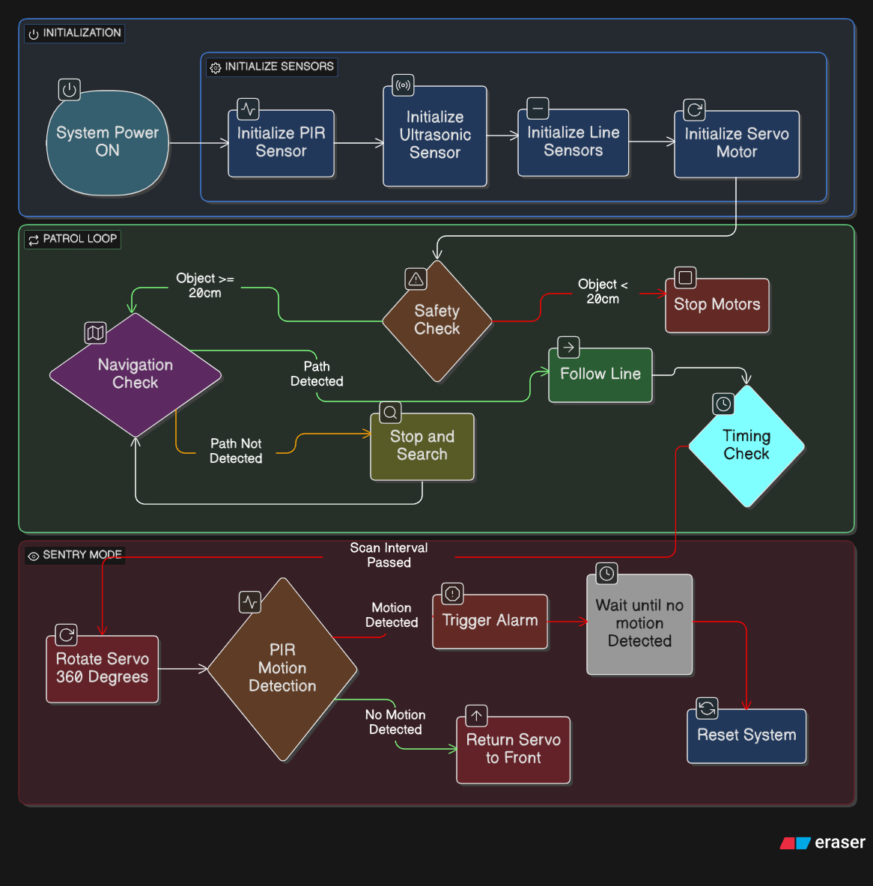

# 🌾 Autonomous Scarecrow Robot

An autonomous, line-following field robot that patrols farmland, detects intruding animals using a PIR sensor mounted on a scanning servo, and scares them off with a deployable actuator and buzzer — all while streaming live sensor data to a Firebase-backed web dashboard for real-time monitoring and manual override.

<p align="center">
  
</p>

## Overview

The robot follows a line-marked patrol path across a field using a 5-channel IR sensor array and a PID controller. When it reaches a marked stop point, it halts, sweeps a PIR motion sensor across three servo positions (180°, 0°, 90°) to scan for animals, and — if motion is detected — can trigger a deterrent actuator and buzzer before continuing its patrol. An ultrasonic sensor provides obstacle avoidance along the way.

All of this is bridged to the cloud: an ESP32 relays sensor state to and from a Firebase Realtime Database, and a React web dashboard lets an operator watch live sensor states, switch between Auto and Manual modes, and drive the robot remotely.

## Features

- **Autonomous line following** — 5-sensor IR array with a tunable PID controller
- **Stop-bar detection** — halts at marked points to run a PIR scan sequence
- **Animal/intruder detection** — PIR motion sensor swept across 3 positions via servo
- **Obstacle avoidance** — ultrasonic sensor halts the robot within a configurable safety distance
- **Deterrent system** — linear actuator + buzzer triggered on motion detection
- **Dual control modes** — Auto (line-following patrol) and Manual (remote drive)
- **Realtime cloud sync** — ESP32 ↔ Firebase Realtime Database
- **Live web dashboard** — React + Vite app with movement controls, mode/servo/buzzer switches, speed slider, and live sensor indicators (keyboard control via WASD + Space supported)

## System Architecture

- **Arduino UNO** — drives motors, reads the IR array, ultrasonic sensor, and PIR sensor, and runs the line-following PID loop and stop-bar/scan logic.
- **ESP32** — bridges the UNO (via serial) to Firebase, authenticates with Firebase User Auth, streams commands down and sensor state up.
- **Firebase Realtime Database** — shared state store (`/robot/...`) between firmware and dashboard.
- **Web Dashboard** — React + Vite app subscribed to the same database path for live control and monitoring.

<p align="center">
  
</p>

## Repository Structure

```
Autonomous-Scarecrow-Robot/
├── code/
│   ├── arduino/
│   │   └── Final.ino          # UNO firmware: motors, IR line-following, ultrasonic, PIR, servo
│   └── ESP32/
│       ├── Final_ESP.ino      # ESP32 firmware: WiFi + Firebase bridge to the UNO
│       └── secrets.h.example  # Template for WiFi/Firebase credentials (copy to secrets.h)
├── web-app/
│   └── robot-dashboard/       # React + Vite + Firebase control dashboard
└── assest/
    ├── docs/                  # Project proposal, progress report, BOM, presentation
    ├── images/                # Diagrams and reference images
    └── robot/                 # Photos of the physical build
```

## Hardware

| Component | Role |
|---|---|
| Arduino UNO | Motor control, line-following PID, ultrasonic, PIR, servo |
| ESP32 | WiFi connectivity, Firebase bridge/auth |
| 5x IR sensors | Line detection array |
| HC-SR04 ultrasonic sensor | Obstacle avoidance |
| PIR motion sensor | Animal/intruder detection |
| Servo motor | Sweeps the PIR sensor across scan positions |
| Linear actuator | Deterrent mechanism |
| Buzzer | Audible deterrent/alert |
| L298N (or similar) motor driver | Drives left/right drive motors |

See [`assest/docs/BOM.xlsx`](assest/docs/BOM.xlsx) for the full bill of materials and [`assest/images/Arduino-uno-pin-diagram.png`](assest/images/Arduino-uno-pin-diagram.png) for pin reference.

<p align="center">
  
</p>

## Getting Started

### 1. Arduino UNO firmware

1. Open `code/arduino/Final.ino` in the Arduino IDE.
2. Install the `Servo` library (built-in) — no other external dependencies required.
3. Wire up motors, IR array, ultrasonic, PIR, and servo per the pin definitions at the top of the file.
4. Flash to the UNO.

### 2. ESP32 firmware

1. Open `code/ESP32/Final_ESP.ino` in the Arduino IDE.
2. Install the required libraries: `FirebaseClient`, `ArduinoJson`, and the ESP32 board package (for `WiFi.h` / `WiFiClientSecure.h`).
3. Copy the credentials template and fill in your real values:
   ```
   cp code/ESP32/secrets.h.example code/ESP32/secrets.h
   ```
   Then edit `secrets.h` with your WiFi SSID/password and your Firebase Web API key, database URL, and Firebase Auth user email/password. **This file is git-ignored — never commit real credentials.**
4. Connect UNO ↔ ESP32 over `Serial2` (pins 16/17 on the ESP32, pins 2/4 on the UNO via `SoftwareSerial`).
5. Flash to the ESP32.

### 3. Web dashboard

```bash
cd web-app/robot-dashboard
npm install
cp .env.example .env   # fill in your Firebase config
npm run dev
```

Build and deploy to Firebase Hosting:

```bash
npm run build
firebase deploy
```

## Firebase Realtime Database Schema

All state lives under `/robot`:

| Path | Type | Description |
|---|---|---|
| `/robot/command` | `F`\|`B`\|`L`\|`R`\|`S` | Manual drive command |
| `/robot/mode` | `A`\|`M` | Auto (line-follow) or Manual (remote drive) |
| `/robot/servo` | `0`\|`1` | Enables/disables the PIR scan servo sweep |
| `/robot/buzzer` | `0`\|`1` | Buzzer on/off |
| `/robot/speed` | `0`–`255` | Drive motor speed |
| `/robot/ultrasonic` | `0`\|`1` | Obstacle detected (read-only, set by firmware) |
| `/robot/pir` | `0`\|`1` | Motion detected (read-only, set by firmware) |
| `/robot/actuator` | `0`\|`1` | Deterrent actuator state (read-only, set by firmware) |

## Screenshots

<p align="center">
  
  
</p>

## Documentation

- [Project Proposal](assest/docs/Project%20Proposal.pdf)
- [1st Progress Report](assest/docs/1st%20Progress%20Report.pdf)
- [Bill of Materials](assest/docs/BOM.xlsx)
- [Project Presentation](assest/docs/Autonomous%20Scarecrow%20Robot.pptx)

## Author

**Wethum Lansakara**
HND Computer Science & AI — IoT & Robotics Project

## License

This project is licensed under the [MIT License](LICENSE).
